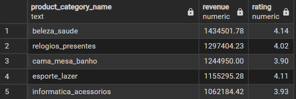
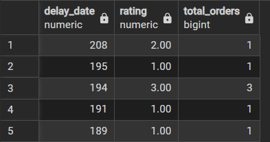

# 📈 Advanced Business Insights

## 1. What is the customer retention rate?
Measures how many customers return to make additional purchases.
Retention Rate=(Repeat Customers/Total Customers)×100
```sql
SELECT 
    ROUND(
        100.0 * COUNT(DISTINCT CASE 
                                WHEN order_count > 1 THEN customer_id 
                              END)
        / COUNT(DISTINCT customer_id),
    2) AS customer_retention_rate
FROM (
    SELECT 
        customer_id,
        COUNT(order_id) AS order_count
    FROM orders
    GROUP BY customer_id
) AS customer_orders;
```
**OUTPUT**

---

## 2. What is the lifetime value of the top customers?
Estimates total revenue contributed by the most valuable customers.
```sql
select o.customer_id,sum(payment_value) as total_revenue from customers c join orders o on o.customer_id=c.customer_id join payments p on 
o.order_id=p.order_id
group by o.customer_id
order by total_revenue desc
limit 10;
```
*OUTPUT*


---

## 3. Which product categories have high sales but low ratings?
Identifies “risk categories” that sell well but may hurt customer satisfaction.
```sql
select p.product_category_name,round(sum(oi.price+oi.freight_value),2) as revenue, round(avg(review_score),2) as rating 
from order_items oi join reviews r 
on oi.order_id=r.order_id
join products p
on p.product_id=oi.product_id
group by product_category_name
order by revenue desc , rating asc;
```
**OUTPUT**

---

## 4. How does delivery time affect customer satisfaction?
Examines whether longer delivery times reduce review scores.
```sql
select extract(day from order_delivered_customer_date-order_purchase) as delay_date,round(avg(review_score),2) as rating,
count(*) as total_orders
from orders o join reviews r
on o.order_id=r.order_id
where order_delivered_customer_date is not null
group by extract(day from order_delivered_customer_date-order_purchase) 
order by delay_date desc;
```
**output**

---

## 5. Which state generates the highest revenue per customer?
Combines geographic and financial data to measure customer value by region.
```sql
select c.customer_state as customer_state,round(sum(p.payment_value)/count(distinct c.customer_id),2) as revenue_state
from customers c join orders o on o.customer_id=c.customer_id join payments p on 
o.order_id=p.order_id
group by c.customer_state
order by revenue_state desc;
```
*OUTPUT*


