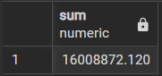

# 🛒 Sales & Revenue Analysis

## 1.What is the total revenue generated by the platform?
This helps measure the overall business performance and the scale of transactions handled by the e-commerce platform.
```sql
select sum(payment_value) from payments;
```
**OUTPUT**

---
## 2.What is the average order value (AOV)?
A key business metric that shows how much customers spend per order on average.
```sql
select round(sum(payment_value)/count(distinct order_id),2) from payments;
```
**OUTPUT**


---
## 3.What are the top 10 highest revenue-generating products? 
Identifies best-selling products that contribute the most to revenue.
```sql
select order_id,round(sum(payment_value),2) as total_revenue from payments
group by order_id
order by sum(payment_value)
desc limit 10;
```
**OUTPUT**


---
## 4.Which product categories generate the most revenue? 
Helps understand which types of products drive the business the most.
```sql
select
pr.product_category_name,round(sum(oi.price+freight_value),2) as total_revenue
from 
products pr join order_items oi
on pr.product_id=oi.product_id
group by pr.product_category_name
order by sum(oi.price+freight_value) desc
limit 1;
```
**OUTPUT**


---
## 5. What is the monthly sales trend over time? 
Shows how sales change over months and helps identify growth patterns or seasonal effects.
```sql
select to_char(o.order_purchase,'yyyy-mm') as month,sum(p.payment_value) as total_revenue from orders o
join payments p
on o.order_id=p.order_id
group by month
order by month desc;
```
**OUTPUT**

---
## 6. Which month had the highest number of orders? 
Reveals peak shopping periods, useful for marketing and inventory planning.
```sql
select to_char(o.order_purchase,'yyyy-mm') as month,round(sum(p.payment_value),2) as total_revenue from orders o
join payments p
on o.order_id=p.order_id
group by month
order by total_revenue desc
limit 1;
```
**OUTPUT**


